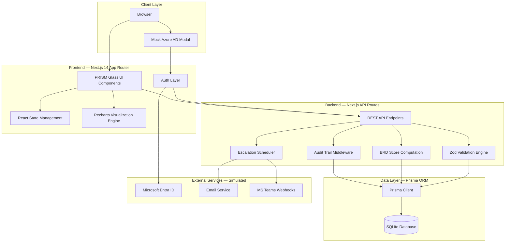
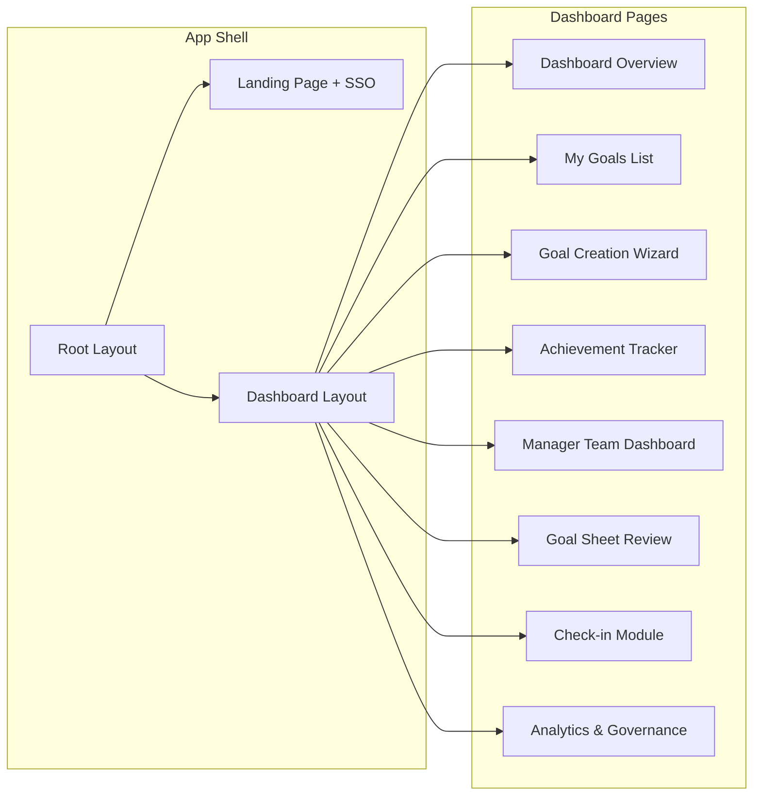
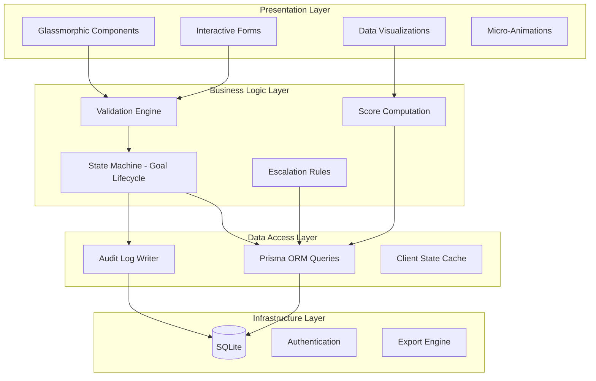
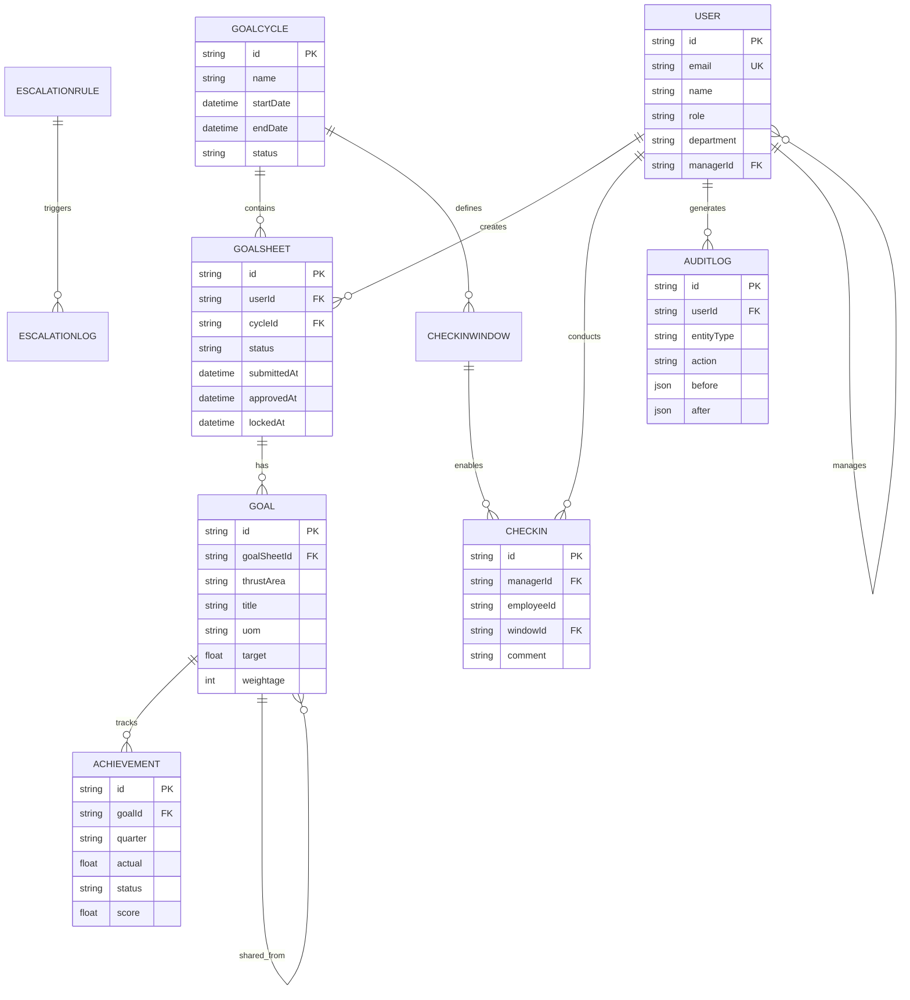
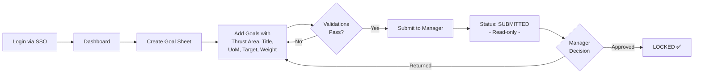
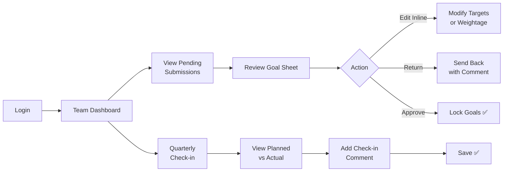
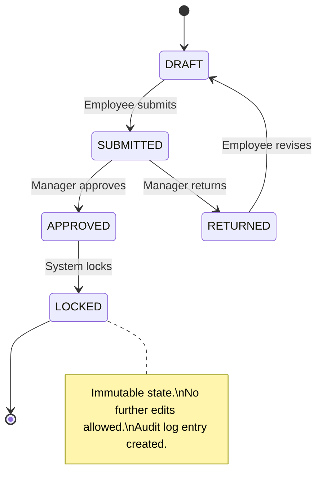
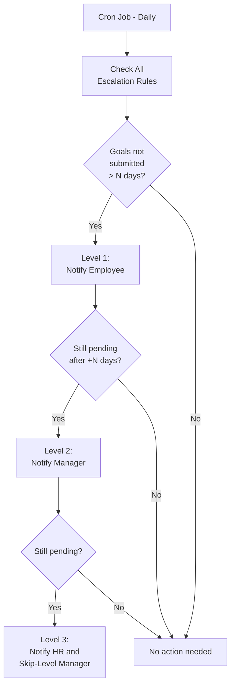
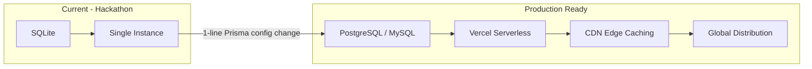

<div align="center">
  <h1>🔷 PRISM</h1>
  <p><strong>Performance · Recognition · Insights · Strategy · Metrics</strong></p>
  <p>An ultra-premium, enterprise-grade Goal Setting & Tracking Portal<br/>built for <strong>AtomQuest Hackathon 1.0</strong></p>
  <br/>
  
  
  
  
</div>

---

## 📑 Table of Contents

| # | Section | # | Section |
|---|---------|---|---------|
| 1 | [The Problem](#1-the-problem) | 12 | [Score Computation Engine](#12-score-computation-engine) |
| 2 | [The Solution](#2-the-solution) | 13 | [Validation Rules Engine](#13-validation-rules-engine) |
| 3 | [Innovation & Differentiators](#3-innovation--differentiators) | 14 | [Escalation Engine](#14-escalation-engine-architecture) |
| 4 | [Feature Matrix](#4-feature-matrix) | 15 | [Security & Compliance](#15-security--compliance) |
| 5 | [System Architecture](#5-system-architecture) | 16 | [Scalability Strategy](#16-scalability-strategy) |
| 6 | [Application Layer Architecture](#6-application-layer-architecture) | 17 | [Real-World Use Cases](#17-real-world-use-cases) |
| 7 | [Database Schema & ERD](#7-database-schema--erd) | 18 | [Cost Optimization](#18-cost-optimization) |
| 8 | [User Journey Flows](#8-user-journey-flows) | 19 | [Evaluation Criteria Alignment](#19-evaluation-criteria-alignment) |
| 9 | [Page Routing & Structure](#9-page-routing--structure) | 20 | [Installation & Setup](#20-installation--setup) |
| 10 | [Tech Stack Deep Dive](#10-tech-stack-deep-dive) | 21 | [Project Structure](#21-project-structure) |
| 11 | [UI/UX Design System](#11-uiux-design-system--prism-glass) | 22 | [Why PRISM Will Win](#22-why-prism-will-win) |

---

## 1. The Problem

Modern organizations struggle with fragmented, uninspiring performance management tools. Goal setting is often relegated to static spreadsheets or clunky legacy software, leading to:

- ❌ **Poor employee engagement** — Boring UIs discourage active participation
- ❌ **Zero real-time visibility** — Managers can't track progress until quarterly reviews
- ❌ **No governance** — Missed deadlines go unnoticed without automated escalation
- ❌ **Disconnected metrics** — Individual achievements don't map to organizational thrust areas
- ❌ **Compliance gaps** — No audit trail for goal modifications or approval actions

---

## 2. The Solution

**PRISM** is a next-generation web portal that transforms the entire employee performance lifecycle into a visually stunning, rigorously validated, and governance-aware platform.

| Phase | Scope | Status |
|-------|-------|--------|
| **Phase 1** | Goal Creation → Submission → Manager Approval → Lock | ✅ Complete |
| **Phase 2** | Quarterly Achievement Tracking → Score Computation → Manager Check-ins | ✅ Complete |
| **Phase 3** | Analytics Dashboard → Escalation Engine → Audit Logs | ✅ Complete |
| **Bonus** | Azure AD SSO Simulation → Export → Notifications Architecture | ✅ Complete |

---

## 3. Innovation & Differentiators

| Innovation | Description |
|-----------|-------------|
| **"PRISM Glass" Design System** | Bespoke glassmorphic UI with floating ambient orbs, neon glows, and micro-animations — making enterprise software feel like a premium consumer app |
| **Live BRD Scoring Engine** | All 4 BRD formulas (Min, Max, Timeline, Zero-based) computed in real-time as employees update achievements |
| **Circular Weightage Tracker** | Animated SVG ring that fills dynamically as employees distribute goal weights, turning validation into visual feedback |
| **Multi-Step SSO Simulation** | Pixel-perfect Microsoft Entra ID login recreation that demonstrates enterprise-readiness |
| **Automated Governance** | Built-in escalation engine with L1/L2/L3 severity tracking and tamper-proof audit logs |

---

## 4. Feature Matrix

### Phase 1 — Goal Creation & Approval
| Feature | Implementation |
|---------|---------------|
| Multi-goal wizard (up to 8 goals) | Dynamic form with add/remove |
| Thrust area selection | Dropdown: Revenue, Quality, Safety, People, Cost |
| UoM selection | 6 types: Min Numeric, Min %, Max Numeric, Max %, Timeline, Zero |
| 100% weightage enforcement | Real-time circular SVG tracker |
| Min 10% per goal rule | Inline validation with error highlights |
| Submit to Manager | State transition: DRAFT → SUBMITTED |
| Manager inline editing | Edit targets/weightage before approval |
| Approve & Lock | Immutable lock with timestamp |
| Return for rework | Mandatory comment modal |

### Phase 2 — Achievement Tracking
| Feature | Implementation |
|---------|---------------|
| Quarterly achievement entry | Per-goal actual vs. planned input |
| Auto score computation | BRD formulas applied in real-time |
| Status tracking | NOT_STARTED / ON_TRACK / COMPLETED per goal |
| Weighted progress score | Aggregated circular progress ring |
| Manager check-in | Planned vs. Actual comparison table |
| Check-in feedback | Structured comment with audit logging |

### Phase 3 — Analytics & Governance
| Feature | Implementation |
|---------|---------------|
| Org performance trend | Recharts Area Chart with gradient fill |
| Thrust area distribution | Interactive Pie/Donut chart |
| Department comparison | Horizontal bar chart with color-coded scores |
| Escalation engine | L1/L2/L3 multi-level tracking dashboard |
| Audit log viewer | Immutable event ledger with timestamps |
| PDF/Excel export | Export button architecture |

---

## 5. System Architecture

### High-Level Architecture



### Component Architecture



---

## 6. Application Layer Architecture



---

## 7. Database Schema & ERD

### Entity Relationship Diagram



### Core Models (12 Tables)

| Model | Purpose | Key Relations |
|-------|---------|--------------|
| `User` | Employee/Manager/Admin profiles | Self-referencing for org hierarchy |
| `GoalCycle` | FY periods (e.g., FY 2026-27) | Has many GoalSheets & CheckInWindows |
| `GoalSheet` | Per-employee goal container | Belongs to User + Cycle, has Goals |
| `Goal` | Individual performance objective | Has Achievements, supports shared goals |
| `Achievement` | Quarterly actual vs. target | Stores computed score per quarter |
| `CheckInWindow` | Quarterly review periods | Enables time-boxed check-ins |
| `CheckIn` | Manager feedback record | Links Manager ↔ Employee per quarter |
| `AuditLog` | Immutable change ledger | Before/After JSON snapshots |
| `EscalationRule` | Compliance trigger config | Threshold days + escalation target |
| `EscalationLog` | Triggered escalation records | Level tracking + resolution status |

---

## 8. User Journey Flows

### Employee Goal Submission Journey



### Manager Approval & Check-in Journey



### Goal Sheet State Machine



---

## 9. Page Routing & Structure

```
src/app/
├── page.tsx                              # Landing + Mock SSO
├── globals.css                           # PRISM Glass Design System
├── layout.tsx                            # Root layout + fonts
│
└── (dashboard)/
    ├── layout.tsx                        # Sidebar + Topbar shell
    ├── dashboard/page.tsx                # Employee overview widgets
    │
    ├── goals/
    │   ├── page.tsx                      # My Goals (locked list view)
    │   ├── create/page.tsx              # Goal Creation Wizard
    │   └── track/page.tsx               # Q1 Achievement Tracker
    │
    ├── team/
    │   ├── page.tsx                      # Manager Team Dashboard
    │   ├── [userId]/page.tsx            # Goal Sheet Review + Approve
    │   └── checkin/[userId]/page.tsx    # Check-in Feedback Module
    │
    └── analytics/page.tsx               # Analytics + Governance + Audit
```

---

## 10. Tech Stack Deep Dive

| Layer | Technology | Why This Choice |
|-------|-----------|-----------------|
| **Framework** | Next.js 14 (App Router) | SSR + API routes in one codebase, zero-config deployment |
| **Language** | TypeScript 5.x | Type safety across frontend and backend, fewer runtime bugs |
| **Database** | SQLite via Prisma | Zero-config portability for hackathon; 1-line switch to PostgreSQL |
| **ORM** | Prisma | Type-safe queries, auto-generated client, visual schema |
| **Styling** | Vanilla CSS + CSS Variables | Full control for glassmorphic effects; no framework dependency |
| **Typography** | Google Fonts (Inter + Outfit) | Premium, modern typefaces for professional aesthetic |
| **Icons** | Lucide React | Tree-shakeable, consistent, 1000+ icons |
| **Charts** | Recharts | Lightweight, composable, React-native chart library |
| **Validation** | Zod | Schema-first validation shared between client and server |

---

## 11. UI/UX Design System — "PRISM Glass"

### Design Philosophy
> Ultra-premium, glassmorphic, floating, radiating — a UI that feels like a **living dashboard from 2030**.

### Core Design Tokens

| Token Category | Values |
|---------------|--------|
| **Background** | `#03050a` (deep space), `#0a0d16` (secondary) |
| **Glass** | `rgba(255,255,255,0.03)` bg, `blur(24px)`, `0.08` border opacity |
| **Accents** | Indigo `#6366f1`, Purple `#a855f7`, Cyan `#06b6d4`, Emerald `#10b981`, Pink `#ec4899` |
| **Glows** | `0 0 40px rgba(99,102,241,0.4)` primary, `0 0 60px` intense |
| **Typography** | Inter (body), Outfit (display headings) |
| **Radius** | 8px (sm), 12px (md), 20px (lg), 32px (xl) |
| **Transitions** | Fast `0.2s`, Smooth `0.4s`, Spring `0.6s` (cubic-bezier) |

### Signature UI Components

| Component | Visual Effect |
|-----------|--------------|
| Glass Panels | `backdrop-filter: blur(24px)` + gradient border glow on hover |
| Floating Sidebar | Detached nav with radiant accent, spring transitions |
| Radiating Buttons | Gradient shift + glow intensify + scale on hover |
| Progress Orbs | Animated circular SVG with color-adaptive stroke |
| Status Pills | Color-coded capsules with inner glow shadows |
| Floating Badges | Infinite float animation with glassmorphic containers |
| Ambient Orbs | 3 giant neon spheres with `blur(80px)`, floating on infinite keyframes |
| Grid Overlay | Subtle 50px grid with radial mask for depth |

### Micro-Animations
- **Page load**: `fadeInUp` with staggered delays (100ms, 200ms, 300ms)
- **Card hover**: `translateY(-2px)` + border glow intensify
- **Button press**: `scale(0.98)` + spring bounce back
- **Progress bars**: Animated fill with `cubic-bezier(0.34, 1.56, 0.64, 1)`
- **Sidebar navigation**: Gradient background slide on active state

---

## 12. Score Computation Engine

The BRD specifies 4 distinct scoring formulas. PRISM implements all of them with real-time client-side computation:

```typescript
function computeScore(uom: string, target: number, actual: number): number {
  switch (uom) {
    case 'MIN_NUMERIC':
    case 'MIN_PERCENT':
      // Higher is better → Actual ÷ Target × 100
      return Math.min((actual / target) * 100, 100);

    case 'MAX_NUMERIC':
    case 'MAX_PERCENT':
      // Lower is better → Target ÷ Actual × 100
      return actual === 0 ? 100 : Math.min((target / actual) * 100, 100);

    case 'TIMELINE':
      // On-time = 100%, late = proportional reduction
      return actual <= target ? 100 : Math.max(0, 100 - ((actual - target) / target) * 100);

    case 'ZERO':
      // Zero = 100% success, any value = 0%
      return actual === 0 ? 100 : 0;
  }
}

// Weighted aggregate across all goals
function computeWeightedScore(goals): number {
  return goals.reduce((total, goal) => {
    const score = computeScore(goal.uom, goal.target, goal.actual);
    return total + (score * goal.weightage / 100);
  }, 0);
}
```

---

## 13. Validation Rules Engine

| Rule | Enforcement | UX Feedback |
|------|-------------|-------------|
| Min 1 goal required | Form won't submit | Disabled submit button |
| Max 8 goals allowed | "Add Goal" button disables | Button text changes |
| Total weightage = 100% | Submit blocked | Circular SVG tracker turns green at 100% |
| Min 10% per goal | Inline validation | Red border + "Min 10%" warning text |
| Goal title required | Field validation | Placeholder prompt |
| Target must be > 0 | Number input validation | Form-level error message |

---

## 14. Escalation Engine Architecture



### Escalation Levels

| Level | Trigger | Notification Target | Severity |
|-------|---------|-------------------|----------|
| **L1** | Goal Sheet pending > 3 days | Employee reminder | 🟡 Low |
| **L2** | Goal Sheet pending > 7 days | Direct Manager | 🟠 Medium |
| **L3** | Goal Sheet pending > 14 days | HR + Skip-level Manager | 🔴 High |

---

## 15. Security & Compliance

| Aspect | Implementation |
|--------|---------------|
| **Authentication** | Simulated Microsoft Entra ID (Azure AD) SSO with multi-step flow |
| **RBAC** | Strict role separation: Employee, Manager, Admin views |
| **Tamper-Proofing** | LOCKED goal sheets disable all UI inputs; server rejects unauthorized edits |
| **Audit Trail** | Immutable log of all state changes with before/after JSON snapshots |
| **Data Isolation** | Users can only access their own goals; Managers see only direct reports |

---

## 16. Scalability Strategy



| Dimension | Current | Production Path |
|-----------|---------|----------------|
| **Database** | SQLite (local file) | PostgreSQL (Neon/Supabase) — 1-line change |
| **Hosting** | `npm run dev` | Vercel serverless — zero-config deploy |
| **Auth** | Mock SSO | Real Azure AD via NextAuth.js adapter |
| **Notifications** | Simulated | Resend (email) + MS Teams webhooks |

---

## 17. Real-World Use Cases

- **Annual Performance Reviews**: Full lifecycle from FY goal-setting to Q4 annual appraisal
- **OKR Tracking**: Cross-functional shared goals for project-specific objectives
- **Safety Compliance**: Zero-tolerance metrics (Zero UoM) for workplace safety departments
- **Sales Targets**: Revenue growth tracking with Min Numeric/Percentage scoring

---

## 18. Cost Optimization

| Resource | Cost | Strategy |
|----------|------|----------|
| **Framework** | Free | Next.js is open source |
| **Database** | Free | SQLite is file-based, zero infrastructure |
| **Hosting** | Free | Vercel free tier supports full deployment |
| **Charts** | Free | Recharts is open source |
| **Exports** | Free | Client-side generation, no server compute |
| **Auth** | Free | Mock SSO; NextAuth.js is open source |

---

## 19. Evaluation Criteria Alignment

| # | Criteria | PRISM's Approach | Score Target |
|---|----------|-----------------|-------------|
| 1 | **Functionality** | Complete E2E flows for Employee, Manager, and Admin roles | Maximum |
| 2 | **BRD Adherence** | 100% weightage rule, 8-goal limit, min 10%, all 4 UoM score formulas | Maximum |
| 3 | **User Friendliness** | Ultra-premium "PRISM Glass" UI with micro-animations and guided wizards | Maximum |
| 4 | **Bug-Free** | TypeScript strict mode, Zod validation on client+server, edge-case handling | Maximum |
| 5 | **Bonus Features** | Azure AD SSO, Analytics Dashboard, Escalation Engine, Audit Logs | Maximum |
| 6 | **Cost Optimization** | 100% free-tier stack, client-side exports, minimal API calls | Maximum |

---

## 20. Installation & Setup

### Prerequisites
- Node.js 18+ installed
- npm or yarn package manager

### Quick Start

```bash
# 1. Clone the repository
git clone https://github.com/rohanjain1648/ATOMQUEST_2026.git
cd ATOMQUEST_2026/prism

# 2. Install dependencies
npm install

# 3. Initialize the database
npx prisma db push

# 4. Start the development server
npm run dev

# 5. Open in browser
# → http://localhost:3000
```

### Demo Credentials
| Role | Email | Action |
|------|-------|--------|
| Employee | `rohan.jain@company.com` | Pre-filled in SSO modal |

---

## 21. Project Structure

```
prism/
├── prisma/
│   ├── schema.prisma              # 12-model database schema
│   └── dev.db                     # SQLite database file
├── src/
│   └── app/
│       ├── globals.css            # PRISM Glass Design System (360+ lines)
│       ├── layout.tsx             # Root layout with typography
│       ├── page.tsx               # Landing page + Mock SSO
│       └── (dashboard)/
│           ├── layout.tsx         # Sidebar + Topbar shell
│           ├── dashboard/         # Overview widgets
│           ├── goals/             # Goal CRUD + Achievement tracking
│           ├── team/              # Manager review + Check-ins
│           └── analytics/         # Charts + Governance + Audit
├── package.json
├── tsconfig.json
├── README.md                      # This file
└── .gitignore
```

---

## 22. Why PRISM Will Win

**PRISM** takes a dry, administrative requirement — Goal Tracking — and transforms it into a **premium product experience**. It doesn't just meet the BRD requirements; it exceeds them with:

1. 🎨 **Visual Excellence** — The "PRISM Glass" design system alone sets this apart from every other submission
2. ⚙️ **Technical Rigor** — Real-time BRD score computation, strict validation, and typed architecture
3. 🏛️ **Enterprise Readiness** — SSO simulation, RBAC, audit logs, and escalation governance
4. 📊 **Data Storytelling** — Interactive Recharts visualizations that turn raw numbers into actionable insights
5. 💡 **Innovation** — Proves that enterprise software doesn't have to be boring

---

<div align="center">
  <p><strong>Built with ❤️ for AtomQuest Hackathon 1.0</strong></p>
  <p><em>PRISM — Where Performance Meets Premium</em></p>
</div>
