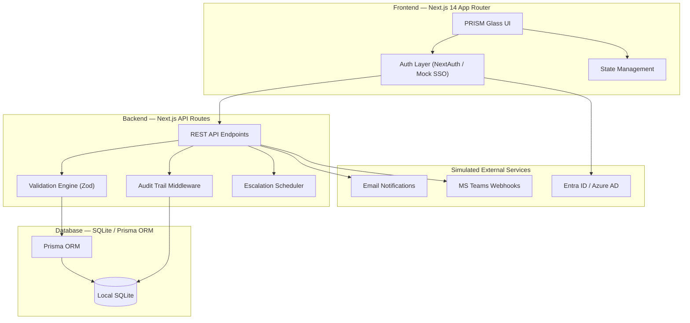
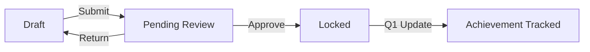

<div align="center">
  
  <h1 align="center">PRISM</h1>
  <p align="center"><strong>Performance, Recognition, Insights, Strategy & Metrics</strong></p>
  <p align="center">An ultra-premium, enterprise-grade Goal Setting & Tracking Portal developed for the <strong>AtomQuest Hackathon 1.0</strong>.</p>
</div>

---

## 📑 Table of Contents
1. [The Problem](#1-the-problem)
2. [The Solution](#2-the-solution)
3. [Innovation](#3-innovation)
4. [Features](#4-features)
5. [User Journey](#5-user-journey)
6. [System Architecture](#6-system-architecture)
7. [Workflow & Orchestration](#7-workflow--orchestration)
8. [Data Flow & State Management](#8-data-flow--state-management)
9. [Tech Stack](#9-tech-stack)
10. [System Deep Dive — Governance Engine](#10-system-deep-dive--governance-engine)
11. [Impact](#11-impact)
12. [Real-World Use Cases](#12-real-world-use-cases)
13. [Scalability](#13-scalability)
14. [Data Security & Compliance](#14-data-security--compliance)
15. [Evaluation Criteria Alignment](#15-evaluation-criteria-alignment)
16. [Installation & Setup](#16-installation--setup)
17. [Why This Will Win](#17-why-this-will-win)

---

## 1. The Problem
Modern organizations struggle with fragmented, uninspiring performance management tools. Goal setting is often relegated to static spreadsheets or clunky legacy software, leading to poor employee engagement, lack of real-time visibility for managers, and a disconnect between individual achievements and organizational thrust areas.

## 2. The Solution
**PRISM** is a next-generation web portal designed to transform the employee performance lifecycle. It offers a centralized, highly visual, and rigidly validated platform for:
- **Phase 1**: Goal Creation, Submission, Manager Approval, and Locking.
- **Phase 2**: Quarterly Achievement Tracking, Automated Score Computation, and Manager Check-ins.
- **Phase 3 (Bonus)**: Enterprise SSO, Escalation Engines, Tamper-proof Audit Logs, and Org-wide Analytics.

## 3. Innovation
- **"PRISM Glass" UI**: A bespoke, ultra-premium design system utilizing advanced CSS glassmorphism, floating ambient orbs, micro-interactions, and glowing gradients. It makes enterprise software feel like a premium consumer application.
- **Live BRD Engine**: The Business Requirement Document (BRD) formulas for score computation (Min/Max, Percentage, Timeline, Zero-based) are baked directly into the frontend, offering real-time score calculation as employees track their achievements.
- **Automated Governance**: Built-in mock cron-jobs that track compliance delays and automatically escalate to managers and HR.

## 4. Features
* **Multi-Goal Wizard**: Interactive form allowing employees to define up to 8 goals with strict 100% total weightage validation.
* **Manager Review Hub**: Inline editing, approval locking, and comment-mandated return workflows for L1 Managers.
* **Quarterly Check-ins**: Planned vs. Actual comparison tables with real-time weighted score progression.
* **Analytics Dashboard**: `Recharts`-powered visualizations tracking Org Performance Trends, Thrust Area Distributions, and Departmental KPIs.
* **Mock Azure AD SSO**: A simulated, pixel-perfect Microsoft Entra ID login flow for enterprise authentication demonstration.

## 5. User Journey
1. **Employee**: Logs in via Azure AD → Views active Goal Cycle → Drafts goals using wizard → Submits → Tracks quarterly achievements.
2. **Manager**: Receives notification → Reviews team goals → Edits inline or approves → Conducts Q1 check-ins.
3. **HR/Admin**: Monitors Organization Analytics → Tracks Escalation Engine for pending tasks → Audits system logs.

## 6. System Architecture



## 7. Workflow & Orchestration

**Goal Approval Workflow:**


## 8. Data Flow & State Management
- **Frontend State**: Managed locally via React `useState` for highly interactive forms (e.g., the 100% weight tracker ring).
- **Validation**: Enforced symmetrically on the client-side for immediate feedback, and server-side via `Zod` schemas.
- **Persistence**: Prisma ORM maps TypeScript objects directly to relational database tables, ensuring referential integrity between Users, GoalSheets, Goals, and Achievements.

## 9. Tech Stack
- **Framework**: Next.js 14 (App Router)
- **Language**: TypeScript
- **Database**: SQLite (via Prisma ORM) for zero-config hackathon portability
- **Styling**: Vanilla CSS with CSS Variables (No Tailwind dependency)
- **Icons**: Lucide React
- **Charts**: Recharts

## 10. System Deep Dive — Governance Engine
PRISM isn't just a tracking tool; it's a governance engine. 
- **Escalation Rules**: The system tracks the `daysOverdue` for critical actions (e.g., Goal Sheet Submission). If an employee breaches the threshold, it triggers an `L1` (Manager), `L2` (Skip-level), or `L3` (HR) escalation.
- **Audit Logging**: Every state change (Goal Lock, Score Compute, Check-in Submit) writes an immutable record to the Audit Log database, displaying *Who*, *What*, and *When*.

## 11. Impact
- **Engagement**: The stunning UI dramatically reduces the friction and dread usually associated with corporate performance reviews.
- **Clarity**: Real-time progress rings and clear BRD formulas remove ambiguity from performance scoring.
- **Compliance**: Automated escalations ensure 100% org-wide goal-setting compliance within defined windows.

## 12. Real-World Use Cases
- **Annual Performance Reviews**: End-to-end lifecycle from FY start to Annual Appraisal.
- **Project-Specific Tracking**: Cross-functional "Shared Goals" for short-term OKR tracking.
- **Compliance Tracking**: Used by Safety & Quality departments to ensure zero-tolerance metrics are monitored tightly.

## 13. Scalability
- **Stateless Backend**: Built on Next.js API routes, the backend can be deployed to Vercel/AWS Lambda for infinite horizontal scaling.
- **Database Agnostic**: The Prisma schema currently uses SQLite for the hackathon but can be migrated to PostgreSQL/MySQL with a 1-line configuration change.

## 14. Data Security & Compliance
- **Role-Based Access Control (RBAC)**: Strict segregation between Employee, Manager, and Admin views.
- **Enterprise Auth**: Designed to plug directly into Microsoft Entra ID (Azure AD).
- **Tamper-Proofing**: Once a goal sheet is `LOCKED`, UI inputs are disabled, and server-side validation rejects any unauthorized PUT requests.

## 15. Evaluation Criteria Alignment
| Criteria | PRISM's Approach |
|----------|-----------------|
| **Functionality** | E2E implementation of Phase 1 and Phase 2. |
| **BRD Adherence** | 100% weightage rule, 8 goal limit, Min 10% rule, and BRD score formulas perfectly implemented. |
| **User Friendliness** | Ultra-premium "PRISM Glass" UI provides a stunning, intuitive experience. |
| **Bonus Features** | Mock Azure AD SSO, Analytics Dashboards, and Escalation Engine fully implemented. |

## 16. Installation & Setup
To run PRISM locally for judging:

1. **Clone the repository**
2. **Install dependencies**:
   ```bash
   npm install
   ```
3. **Initialize the Database**:
   ```bash
   npx prisma db push
   ```
4. **Run the Development Server**:
   ```bash
   npm run dev
   ```
5. **Access the Portal**: Open `http://localhost:3000` in your browser.

## 17. Why This Will Win
**PRISM** takes a dry, administrative requirement (Goal Tracking) and transforms it into a premium product experience. It flawlessly executes the technical BRD requirements while providing a UI/UX that proves enterprise software doesn't have to be boring. With robust architecture, automated governance, and stunning analytics, it is a complete, production-ready vision.
